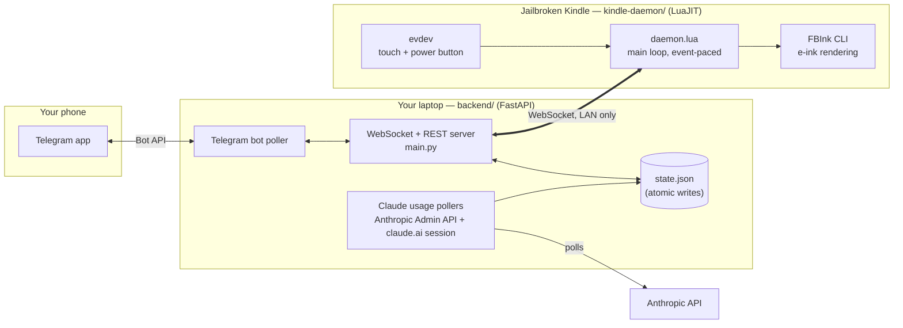
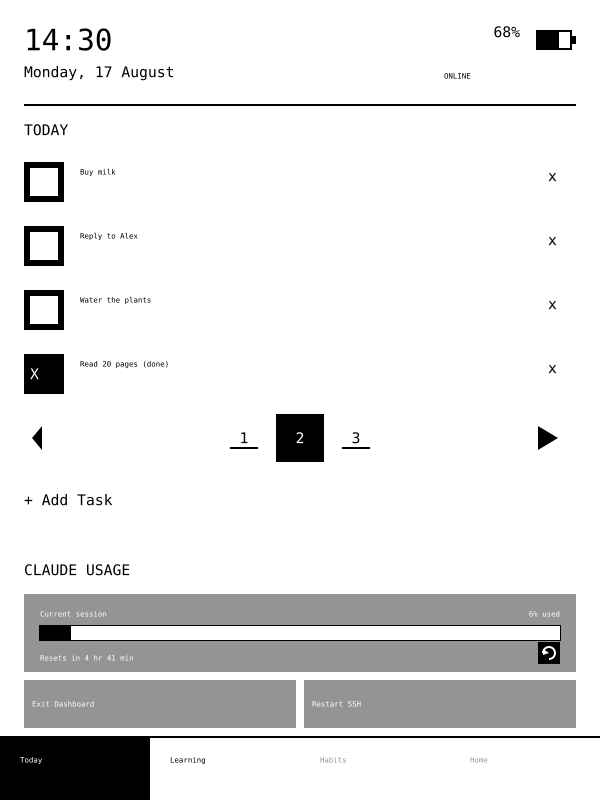
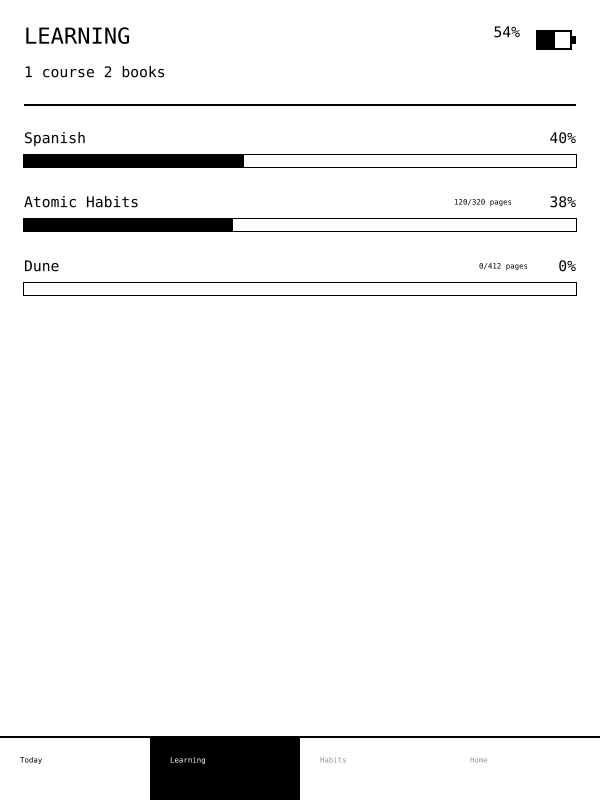
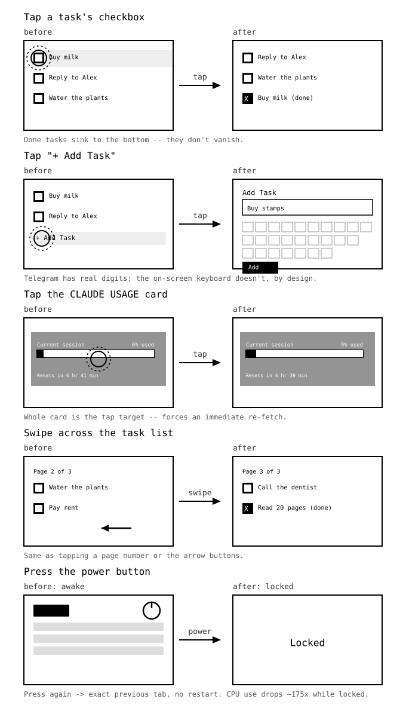

# Kindle Dashboard


A personal dashboard on a jailbroken Kindle e-reader: a Today screen with
your task list and Claude usage, a Learning screen tracking your progress
through courses and books, and a Telegram bot to feed both — rendered
directly to the e-ink screen and controlled by touch, swipe, and the
power button (which locks the screen and idles the dashboard). No cloud,
no third-party service — the backend runs on your own laptop.

> ### ⚠️ Vibe-coded disclaimer
> This entire project — architecture, backend, the native Kindle daemon,
> the tests, and these docs — was built through conversational
> pair-programming with **[Claude Code](https://claude.com/claude-code)**
> (Anthropic's [Claude](https://www.anthropic.com/claude), Sonnet 5
> model), directed and verified on real hardware by a single hobbyist with
> no professional software background. "Vibe-coded" here means the
> author described what they wanted and reviewed/tested the result, not
> that the code is unverified: every feature listed below was deployed to
> the physical Kindle and confirmed working, and the project carries eight
> automated test suites (see [Tests](#tests)). Treat it as a solo, AI-assisted
> hobby project, not audited or production-grade software — read before you
> run it, especially anything touching your home network or your Kindle's
> filesystem.

## What it is, in one paragraph

An old Kindle sits on a desk showing a dashboard instead of a book: the
time, today's tasks, what you're learning, and how much of your Claude
usage allowance you've used. You tap the screen to tick things off, and
add new things from your phone over Telegram. Nothing leaves your home
network — the "brain" is a small server you run on your own laptop, and
the Kindle only ever talks to that.

Want the full plain-English feature tour? Read **[`CHANGELOG.md`](CHANGELOG.md)**.
New to this repo and want to set it up? Read **[`docs/LAUNCH_GUIDE.md`](docs/LAUNCH_GUIDE.md)**.

## How it fits together



Everything above runs on your own hardware and your own home network. The
only outbound call is the backend polling the Anthropic API for usage
numbers (optional, off by default until you add a key).

## Tech stack

| Layer | Where | Language / tools | What it does |
|---|---|---|---|
| **Backend** | `backend/` (runs on your laptop) | Python 3.11+, [FastAPI](https://fastapi.tiangolo.com/) + [uvicorn](https://www.uvicorn.org/), [httpx](https://www.python-httpx.org/) | Serves the WebSocket the Kindle connects to, polls the Telegram Bot API, polls the Anthropic API for usage stats, persists state as JSON |
| **Kindle daemon** | `kindle-daemon/` (runs on the Kindle) | [LuaJIT](https://luajit.org/) + FFI, no external Lua libraries | Renders the UI by shelling out to the `fbink` CLI already on the device; reads touch/power input via `evdev`; hand-written WebSocket client, JSON codec, SHA-1, and base64 (all in `src/`) since the device has no package manager |
| **Lockscreen** (optional) | `lockscreen/` | Shell script + KOReader config | Replaces the stock Kindle screensaver image with custom text |
| **Messaging** | Telegram | [Telegram Bot API](https://core.telegram.org/bots/api) (raw HTTP, no SDK) | Add/list/complete tasks and learning progress from your phone |
| **Usage tracking** (optional) | Anthropic | [Anthropic Admin API](https://docs.anthropic.com/) + an unofficial claude.ai session endpoint | Powers the "Claude usage" card on the Today screen |
| **Display hardware** | Kindle 7th Gen (KT2) confirmed | [FBInk](https://github.com/NiLuJe/FBInk) | Direct framebuffer drawing to e-ink, no X server dependency |

No database, no cloud service, no build step — the backend is a single
Python process and the daemon is a single Lua process.

## Screens

There's no simulator and no rendered image path for this device — the
daemon draws straight to the e-ink framebuffer via `fbink`, so these
aren't photos, they're mockups built pixel-for-pixel from the real
layout constants in `kindle-daemon/src/ui.lua` (600x800, the actual
panel resolution). Colour is flat black/white/gray on purpose: that's
what the hardware is.

**Today** — clock, battery, connection status, the task list (checked
tasks sink to the bottom instead of disappearing), pagination, the
Claude usage card, and the two recovery buttons:



**Learning** — courses and books, each with a derived or manual
progress bar. Read-only on-device; all edits happen from Telegram:



**Locked** — the power button blanks the screen to this rather than
going fully dark, so a locked dashboard is never mistaken for a crashed
one:


### Interactions

E-ink doesn't animate — there's no motion to show, no GIF that would be
honest about how this hardware behaves. It snaps between static frames
on refresh. So instead of a video, here's what each gesture actually
does to the screen, as a before/after:



## Layout

```
backend/       -- FastAPI service (runs on your laptop): Telegram bot,
                  Anthropic usage polling, WebSocket push to the Kindle.
                  See backend/README.md.
kindle-daemon/ -- standalone Lua daemon that runs directly on the Kindle
                  (not inside KOReader): renders the dashboard via FBInk,
                  reads touch via evdev, connects to the backend.
                  See kindle-daemon/README.md (architecture) and
                  kindle-daemon/INSTALL.md (on-device setup).
lockscreen/    -- optional: replaces the Kindle's stock screensaver with
                  custom text. See lockscreen/README.md.
docs/          -- setup guide, jailbreak reference, and secrets policy.
```

Already set up? Day-to-day use is two double-clickable scripts:
`kindle-daemon/ops/Start_Dashboard.bat` and `Stop_Dashboard.bat` — see
`kindle-daemon/ops/README.md`.

## Tests

There are eight suites. All of them run on your laptop with no Kindle, no
network, and nothing to install beyond what the backend already needs:

```
cd kindle-daemon/tests && luajit test_gestures.lua        # tap/swipe classification
cd kindle-daemon/tests && luajit test_keys.lua            # power button / screen lock
cd kindle-daemon/tests && luajit test_layout.lua          # every screen's layout
cd kindle-daemon/tests && luajit test_hit_resolution.lua  # what a tap actually hits
cd kindle-daemon/tests && luajit test_poll_pacing.lua     # wakeups + connection watchdog
cd kindle-daemon/tests && luajit test_discovery.lua       # beacon parsing/validation
python backend/tests/test_learnings.py                    # from the repo root
python backend/tests/test_discovery.py                    # from the repo root
```

`test_layout.lua` swaps a recorder in for the `fbink` CLI, renders each
screen, and checks the drawing commands that *would* have been sent —
nothing off-screen, no overlapping tap targets, none under 40px,
pagination eliding the right pages.

`test_hit_resolution.lua` covers the gap that leaves: it takes those same
tap zones and runs the *daemon's* own hit-testing over concrete pixel
coordinates, asserting each lands on the control you aimed at. That
distinction is not academic — a bug that made the entire task area
untappable was invisible to the layout test (the layout was perfectly
self-consistent; the consumer resolved it wrong) and is caught
immediately by this one.

`test_poll_pacing.lua` is about battery rather than pixels. The daemon
sleeps until its next piece of timed work instead of waking on a fixed
tick (~120 wakeups an hour rather than 7200), which is only safe as long
as every deadline actually moves forward when it fires — one that doesn't
turns the loop into a spin. This suite runs those timers against a
simulated clock and counts, and covers the watchdog that spots a
connection which has died without being closed.

The two `test_discovery` suites sit on either side of one wire format:
Python builds the beacon, Lua parses it, and nothing but the format
connects them — a drift produces no error anywhere, just a dashboard that
quietly loses the ability to recover from an IP change. Each side pins the
format, and the Lua one leans hardest on the *rejection* cases, since that
parser decides where the daemon connects and any device on your network
can send it a beacon.

Together they cover the arithmetic. They deliberately cannot tell you
whether anything *looks* right on real e-ink — ghosting, whether the
pixel-art arrows read as triangles, whether a 2px outline is visible at
167ppi. `kindle-daemon/tools/` holds the on-device diagnostics for that.

## Is my Kindle compatible?

This project needs a **jailbroken** Kindle (meaning its normal software
restrictions have been removed, so it can run programs Amazon didn't put
there — see `docs/JAILBREAK_REFERENCE.md`), with KUAL and KOReader
installed on top of that. It was built and tested against a Kindle 7th
Gen (2014, model WP63GW, KT2 hardware) jailbroken via WinterBreak2. Other
jailbroken Kindle models will likely also work once KUAL/KOReader are
installed, but haven't been tested — check
`kindle-daemon/README.md`'s "What is genuinely unverified" section
before investing time on a different device.

## Security

Real secrets (Telegram bot token, Anthropic API key, the Kindle's local
config) never live in this repo — see `docs/SECRETS.md` for the policy
this project follows.

## Credits

Built by [deckerwastaken](https://github.com/deckerwastaken) in
conversational pair-programming sessions with
**[Claude Code](https://claude.com/claude-code)** running
**[Claude](https://www.anthropic.com/claude) Sonnet 5**, [Anthropic](https://www.anthropic.com)'s
coding-agent CLI. See the disclaimer at the top of this README for what
that means in practice. No other third-party services, SDKs, or paid
tools were used — everything here talks directly to FBInk, evdev, the
Telegram Bot API, and the Anthropic API over plain HTTP/WebSocket.

## License

MIT — see `LICENSE`. Use it, fork it, adapt it for your own Kindle.
